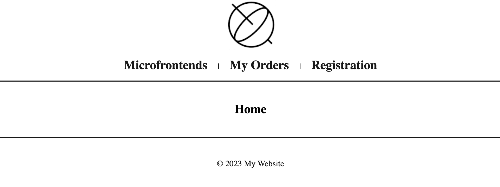

# microfrontends
Distributed frontend architecture for medium & large companies.


### What are Microfrontends?

Microfrontends are an architectural approach for web development where a frontend application is divided into smaller, semi-independent "microapps" working seamlessly together. This concept extends the principles of microservices to frontend development, enabling different teams to work autonomously on different parts of a frontend. Each microfrontend can be developed, tested, and deployed independently using potentially varied frameworks or technologies, yet when combined, they form a cohesive user interface. This approach offers benefits like improved scalability, easier code management, and faster development cycles, especially in large-scale projects with multiple teams, but it also introduces challenges such as ensuring consistent user experience and managing interdependencies.

### What is Webpack?

Webpack is a powerful and widely-used open-source JavaScript module bundler that processes and bundles various assets like JavaScript, HTML, CSS, and images into a single output file or multiple output files optimized for production use. It works by creating a dependency graph which maps every module your project needs and then packages those modules into one or more bundles. Webpack is highly extensible, supporting a vast range of plugins and loaders that allow developers to customize how assets are processed, transformed, and bundled. Its core features include code splitting, module replacement, and asset management, making it an essential tool for modern web application development, especially in complex projects that involve a large number of assets that need to be managed and served efficiently.

### What is SSI?

Nginx Server Side Includes (SSI) is a feature of the Nginx web server that allows for the inclusion of content from other files or servers into an HTML page at the time it is served. Functioning similarly to a basic templating engine, SSI enables developers to dynamically insert data into web pages, such as headers, footers, or other reusable components, by using special directives embedded within HTML comments. This simplifies HTML document maintenance and promotes content reuse, making it easier to manage large websites with shared elements. It's particularly useful for assembling web pages from disparate sources or fragments without the need for more complex server-side scripting. Nginx processes these SSI directives on the fly as it serves the content, offering a server-side solution to dynamically compose web pages, which can be a more efficient alternative to client-side AJAX calls for certain use cases.

### What is `h-include`?

The h-include library is a lightweight JavaScript library that facilitates the implementation of microfrontends by allowing web pages to include fragments from other pages as part of their HTML content. It works on the concept of "transclusion", a method to compose a complete webpage by including partial HTML snippets from various sources, similar to server-side includes but performed on the client side. With h-include, developers can easily integrate different parts of a web application, each potentially developed and deployed independently, into a single unified interface. This is particularly useful in a microfrontend architecture, as it helps in breaking down a frontend monolith into smaller, more manageable pieces while maintaining a seamless user experience. The library does this by fetching HTML snippets using AJAX and embedding them into the main document, thereby enabling more modular and flexible frontend structures.

### Components

- [./core](./core): Application shell.
- [./nav](./nav): Navigation bar.
- [./footer](./footer): Application footer.
- [./pages](./pages): Pages container.
- [./home](./pages): Home page.
- [./orders](./pages): Orders page.
- [./auth](./pages): Registration page.

## Instructions

Build components:

```bash
cd nav/ && npm install && npm run-script build
cd footer/ && npm install && npm run-script build
cd home/ && npm install && npm run-script build && npm link
cd orders/ && npm install && npm run-script build && npm link
cd auth/ && npm install && npm run-script build && npm link
cd pages/ && npm install && npm link microfrontends-auth && npm link microfrontends-orders && npm link microfrontends-home && npm run-script build
```

Start the main application:

```bash
docker compose up
```


